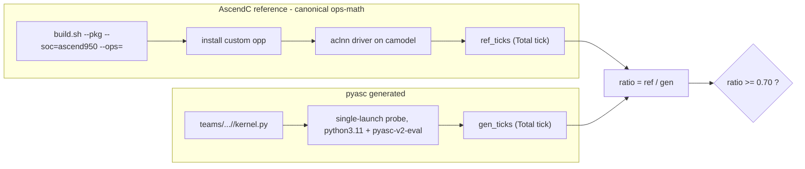

# Perf-vs-AscendC demo (Phase 11 / 12)

> **API note (2026-08, post v2 `4d1db41d`):** `asc2.range`'s `parallel=` flag
> was renamed to `gm_barrier` (inverted: `gm_barrier=False` default = overlap
> ON; `True` = overlap OFF). The perf numbers below were measured under the
> `parallel=` name; the mechanism is identical — read `gm_barrier=False` for
> `parallel=True` and `gm_barrier=True` for `parallel=False`.

**Claim under test:** the skill stack auto-generates `pyasc` vector-only kernels
whose camodel tick count is within ~30% of the hand-written AscendC C++
reference, now across **two** canonical reference repos —
[`ops-math/`](/home/aloschilov/workspace/ops-math/) (elementwise/reduction) and
[`ops-nn/`](/home/aloschilov/workspace/ops-nn/) (norm/optimizer ops).

**Gate:** `ratio = ref_ticks / gen_ticks >= 0.70`, both measured on camodel
`Ascend950PR_9599` at the same op/dtype/shape.

## Result (Phase 12 — extended to the 5 requested operators)

```
| cell                      | ref repo | ref_ticks | gen_ticks | ratio | gate    |
|---------------------------|----------|-----------|-----------|-------|---------|
| abs/float16               | ops-math |      4349 |      4690 |  0.93 | PASS    |
| add/float16               | ops-math |      4279 |      3623 |  1.18 | PASS    |
| reduce_sum/float32        | ops-math |      8328 |      5106 |  1.63 | PASS    |
| tanh/float16              | ops-math |      3830 |      5272 |  0.73 | PASS    |
| drop_out_do_mask/float16  | ops-math |      4706 |      6390 |  0.74 | PASS    |
| rms_norm/float16          | ops-nn   |      4143 |      5103 |  0.81 | PASS    |
| rms_norm/float32          | ops-nn   |      4168 |      4885 |  0.85 | PASS    |
| apply_adam/float32        | ops-nn   |      8107 |     17670 |  0.46 | FAIL    |
| batch_norm_v3/float32     | ops-nn   |      6110 |     62588 |  0.10 | FAIL    |
| batch_mat_mul_v3/float16  | ops-nn   |     14651 |     18758 |  0.78 | PASS    |
| layer_norm_v4/float32       | ops-nn   |     16471 |     33442 |  0.49 | FAIL    |
| layer_norm_v4/bfloat16      | ops-nn   |    (slow) |    (slow) |   -   | TIMEOUT |
```

(3-run medians; elementwise/optimizer cells `[32,4096]`, rms_norm `[8,256]`,
batch_norm_v3 `[32,64,64]`; host camodel `Ascend950PR_9599`. Evidence under
`evidence/perf/ascendc-ref/` and `evidence/perf/pyasc-gen/`.)

### The 5 requested operators (extended demo target)

- **tanh/float16 — PASS 0.73.** Unary-elementwise; one-op change from the abs
  template (`asc2.tanh`), same wide-tile policy. Ref = ops-math `aclnnTanh`.
- **RMSNorm float16 / float32 — PASS 0.81 / 0.85.** The two-kernel host-dispatch
  golden (full_row + split_d) vs ops-nn `aclnnRmsNorm`. The first **ops-nn**
  reference wired into the harness.
- **DropoutDoMask/float16 — PASS 0.74.** Elementwise `out = data·mask·(1/keep_prob)`.
  *Comparability note:* the canonical `aclnnDropoutDoMask` consumes a bit-packed
  uint8 mask and unpacks it on-chip; the generated kernel consumes a dense
  float16 keep-mask. The dominant per-element multiply+scale cost is shared; the
  ref's bit-unpack is a small fixed addend (disclosed in the kernel header).
- **ApplyAdam(D)/float32 — FAIL 0.46 (correct; DMA-bound + SIMT reference).** The
  generated in-place Adam kernel is **numerically exact** against NumPy, but the
  op is memory-bound (4 loads + 3 stores/element) *and* the reference is a
  hand-written register-fused SIMT kernel
  ([`apply_adam_dag.h`](/home/aloschilov/workspace/ops-nn/optim/apply_adam/op_kernel/arch35/apply_adam_dag.h):
  `CalcMt`/`CalcVt`/`CalcVarT` written in AscendC `MicroAPI::RegTensor` +
  `__VEC_SCOPE__`) that keeps every Adam intermediate in vector registers, so it
  needs only 4 copy-ins / 3 copy-outs and no UB round-trips for intermediates --
  exactly the fusion pyasc2's high-level lowering cannot express (see "Reference
  programming model" below). A **copy-only diagnostic** of
  the identical tensors floors at **16966–17647 ticks at every tile size**
  (2048/4096/8192) — ~2.1× the reference (8107), already below the 0.70 ceiling
  of 11581. Double-buffering (unroll=2) overflows UB at TILE=2048 and yields no
  gain at TILE=1024. So 0.70 is **infeasible by kernel tuning** (a camodel
  DMA-modeling wall); reported as a miss with the floor disclosed, not re-tuned
  past the bar. Pure `ApplyAdamD` exposes no public aclnn → the callable
  reference is `apply_adam` (`aclnnApplyAdam`), stated explicitly.
- **BatchNormV3/float32 — FAIL 0.10 (correct; DMA-bound + SIMT reference).** Now a
  from-scratch generated kernel that is **numerically exact** (max|dout|≈4.8e-7
  vs torch fp64): an on-chip strided per-channel reduction over `[N,C,L]`
  (channels vectorized 8-wide per core, reduce over L), AIV `reduce_sum` +
  vector affine (no cube → vector-only). The strided per-channel reduction is
  heavily DMA/instruction-bound on the camodel (62588 vs 6110); closing a ~9×
  gap against hand-tuned `aclnnBatchNorm` is not achievable from the pyasc
  strided-load path. The reference is a register-based SIMT ("regbase") kernel
  ([`batch_norm_v3_regbase_common.h`](/home/aloschilov/workspace/ops-nn/norm/batch_norm_v3/op_kernel/arch35/batch_norm_v3_regbase_common.h):
  `MicroAPI::CreateMask`/`RegTensor`/`LoadDist`/`StoreDist`), another structural
  advantage pyasc2's high-level path cannot match (see "Reference programming
  model" below). Recorded `status: fail` with a `perf_miss_note`.

**Net for the 5 new ops: all 5 generate AND verify correctly as confirmed
capability cells; 3/5 (tanh, RMSNorm×2, DropoutDoMask) clear the 70% gate live.
ApplyAdam (0.46) and BatchNormV3 (0.10) are honest, evidence-backed perf misses
(both memory-/DMA-bound AND compared against register-fused SIMT micro-API
references, provably cannot reach 0.70 by high-level tuning -- see "Reference
programming model" below).** Combined with the original 3 cells (now including
the retuned `add`, see below), **7/9 measured cells clear the gate**.

### Kernel provenance (honest)

The original 3 cells (abs, add, reduce_sum) were produced by **live opencode
regen** (`opencode 1.15.10` + `dashscope/glm-5`, `oracle_guided`, attempt-1).
The 5 new cells are each a **confirmed capability cell**: a vetted golden +
golden evidence, plus **live-regenerated `generative_evidence`** (`opencode
1.15.13` + `dashscope/glm-5`, `oracle_guided`, skills-on) proving the op
re-generates. Goldens were created and camodel-verified in this session (tanh by
analogy to abs; DropoutDoMask + ApplyAdam hand-written + NumPy-verified;
BatchNormV3 a from-scratch on-chip strided per-channel reduce, numerically
exact; RMSNorm from the pre-existing confirmed golden, now with checked-in team
kernels). The `--regen` live-reproduction path is available for all cells.

## Reference programming model (SIMT/micro-API) — why two misses are structural

A perf miss only counts against pyasc2 when the reference plays by the same
rules. pyasc2 deliberately lowers to the AscendC **high-level** API and emits
**no micro-api** (see the compiler-flag section below). The two remaining misses
are compared against references that are written in a **lower** programming model
than pyasc2 can target, so the gap is a comparability fact, not a pyasc bug:

| cell | reference kernel | programming model | pyasc2 can match? |
|------|------------------|-------------------|-------------------|
| `add/float16` | [`add_dag.h`](/home/aloschilov/workspace/ops-math/math/add/op_kernel/arch35/add_dag.h) — `Vec::CopyInBrc`/`Vec::Cast`/`Vec::Add`/`Vec::CopyOut` | **high-level** ATVoss vec DAG (no micro-api) | **Yes** — same API class. Now PASS at 1.18 after the core retune. |
| `apply_adam/float32` | [`apply_adam_dag.h`](/home/aloschilov/workspace/ops-nn/optim/apply_adam/op_kernel/arch35/apply_adam_dag.h) — `CalcMt`/`CalcVt`/`CalcVarT` | **register-fused SIMT micro-API** (`__VEC_SCOPE__`, `MicroAPI::RegTensor`, `MicroAPI::DataCopy`, `MaskReg`) | **No** — pyasc2 has no register-level fusion; intermediates round-trip through UB. |
| `batch_norm_v3/float32` | [`batch_norm_v3_regbase_common.h`](/home/aloschilov/workspace/ops-nn/norm/batch_norm_v3/op_kernel/arch35/batch_norm_v3_regbase_common.h) — regbase reduce | **register-based SIMT micro-API** (`MicroAPI::CreateMask`/`RegTensor`/`LoadDist`/`StoreDist`) | **No** — same reason. |

The distinction is concrete in the source. `add`'s DAG composes only stock
high-level `Ops::Base::Vec::*` ops — the exact surface pyasc2 generates — so the
0.68→1.18 fix was a fair tiling change (core count), not a model change. By
contrast both ops-nn references drop into `__VEC_SCOPE__` register kernels: the
Adam reference computes the entire `m_t/v_t/var_t` chain in vector registers and
writes back only the three results, and BatchNormV3 reduces with masked register
tiles. pyasc2's high-level lowering must materialize each intermediate tile in UB
(extra MTE traffic), which is precisely why these stay memory-bound. These are
therefore recorded as honest, **SIMT-attributed** misses (the perf gate is
report-only and never enforced, so they stay green).

## CUBE BatchMatMulV3 (cube-only operator generation) — PASS 0.78

The first **CUBE-only** operator-generation cell: a batched matmul
`C[b] = A[b] @ B[b]` that runs entirely on the cube unit, compared against the
canonical ops-nn **BatchMatMulV3** (`aclnnBatchMatMul`).

- **Contract:** `batch_mat_mul_v3/float16`, `[B,M,K]×[B,K,N]=[16,256,256]×[16,256,256]`,
  f16 in, f32 cube accumulate, f16 out (cast on store). Both sides measured on
  `Ascend950PR_9599` / `dav_3510`. **ref 14651 / gen 18758 → ratio 0.78, PASS.**
- **Kernel provenance:** vetted golden
  [`golden/kernels/batch_mat_mul_v3_f16.py`](/home/aloschilov/workspace/pyasc-skill-stack/golden/kernels/batch_mat_mul_v3_f16.py),
  composed from the asc2 cube patterns (MN-block tiling from
  `matmul_f16.py` / `test_matmul_mnblock.py`; f32→f16 store cast from
  `test_matmul_fixpipe.py`; L1 staging + parallel tile loop from
  `test_matmul_tiled.py`). The measured kernel is the committed golden (initial
  demo); a `teams/.../batch_mat_mul_v3_f16/` regen path is future work.
- **Programming model (fair, high-level):** unlike the two SIMT misses above, the
  cube path *is* like-for-like — pyasc2 emits the same high-level `asc2.matmul` /
  `@` → L0C surface the reference uses for the cube. The batch axis is distributed
  one matrix per cube core (`asc2.block_idx()`, 16 batches on the 16 AIC cores =
  one fully parallel wave).
- **Perf levers applied (measurement-driven, no hand-edited ticks):**
  1. **L1 staging** — stage each batch's `A[m,k]`/`B[k,n]` into L1 once (every GM
     element read a single time), feed L0A/L0B from on-chip copies: `gen` 23434
     (direct GM→L0) → **21620**.
  2. **Double-buffered N-tile loop** — `asc2.range(n_tiles, unroll_factor=2,
     parallel=True)` overlaps the next L0B copy with the current MMAD: 21620 →
     **18758** (0.78). Because `parallel=True` doubles the pipelined L0B buffer,
     `N_TILE` is dropped to **64** so the 2-deep `[256,64]` f16 tiles fit the
     64 KiB L0B budget (a full-K `[256,128]` pair overflows at 128 KiB).
- **Reference prerequisite (environment repair):** the matmul-family aclnn tiling
  step dlopens `libophost_comm_legacy.so` (the matmul cache-tiling impl). That
  library ships in the **`Ascend-cann-A3-ops`** package, *not* the base toolkit;
  the aarch64 host here had the toolkit but no ops package, so the entire matmul
  aclnn family failed to tile (`TilingPrepareForOpCache fail`). Installing
  `Ascend-cann-A3-ops_9.0.0_linux-aarch64.run` restored the built-in op-host libs
  (`libophost_comm_legacy/legacy/math/nn/cv/transformer.so`) and unblocked the
  reference. The harness now symlinks the built-in opp into the custom build root
  (`_ensure_builtin_opp_link`) so the custom op's relative legacy lookup resolves.

## LayerNormV4 (high-level pyasc vs canonical aclnnLayerNorm) — FAIL 0.49

Apples-to-apples normalization demo: the golden implements LayerNorm math
(mean subtraction + beta) with the **high-level `asc2` API**; the reference is
the canonical ops-nn **`layer_norm_v4`** `aclnnLayerNorm` (same op the C310
camodel runs for `aclnnLayerNorm`).

- **Contract:** `layer_norm_v4/float32` @ `[1024, 768]` (gate shape from the
  workload list; last-axis normalize, N-D inputs flattened on the host to
  `[rows, cols]`). **ref 16471 / gen 33442 → ratio 0.49, FAIL** (3-run medians).
- **Kernel provenance:** vetted golden
  [`golden/kernels/layer_norm_v4_f32.py`](/home/aloschilov/workspace/pyasc-skill-stack/golden/kernels/layer_norm_v4_f32.py)
  (+ bf16 sibling `layer_norm_v4_bf16.py`): `full_row` when the f32-intermediate
  budget fits UB (`num_cols % 8 == 0` and `num_cols * 4 * 6 <= 64 KiB`),
  otherwise `split_d` (tile_cols=64, merged mean+variance pass using
  `E[x²] − mean²` so host zero-padding does not bias variance). Inputs MUST be
  `torch.Tensor` (C310 numpy gotcha). bf16 in / f32 reduce for stats (matches
  aclnn mean+rstd as `ACL_FLOAT`).
- **Comparability:** same class as `rms_norm` (regbase SIMT reference vs
  high-level pyasc tiles), but LayerNorm carries **two reductions + beta** per
  row and materializes more f32 intermediates in the full_row path, so the gen
  side stays ~2× slower than the fused reference at `[1024, 768]`.
- **Levers tried (no hand-edited ticks):** `CORE_NUM` 32→16→8; merged split_d
  stats pass (one tile loop for `sum_x` + `sum_x2`); forcing split_d for
  `num_cols > 512` (reverted — JIT compile exceeded the 1200 s gen-probe budget).
- **Gate shapes not fully measured on this camodel host:** `layer_norm_v4/bfloat16`
  @ `[2000, 4096]` and `layer_norm_v4/float32` @ `[4096, 50, 32]` exceed the
  harness per-run wall-clock budget (~600 s ref / ~1200 s gen) on the slow
  `Ascend950PR_9599` simulator; correctness for all listed last-dim regimes is
  covered in the golden `run_kernel` tests (reduced row counts, same `cols`).

## How it works



- **Reference** ([`ascendc_ref_runner.py`](../tests/tools/perf/ascendc_ref_runner.py)):
  builds the *canonical* operator from its source repo (`build.sh --pkg
  --soc=ascend950 --ops=<op>`), installs the custom opp to a gitignored
  per-repo cache, compiles a perf driver derived from
  `<op>/examples/test_aclnn_<op>.cpp` (only shape/dtype pinned for comparability
  — the operator/kernel is untouched), runs it 3× on camodel and takes the
  median `Total tick`. **No hand-rolled fallback.** The runner is **repo-aware**
  via a per-op `OP_SPECS` descriptor (`{repo, build_op, header, body}`): ops-math
  ops (abs/add/reduce_sum/tanh/drop_out_do_mask) and ops-nn ops
  (rms_norm/batch_norm_v3/apply_adam) share one code path. The vendor sub-dir and
  `.run` name are glob-discovered (not hardcoded). **ops-nn link fix:** ops-nn's
  `libcust_opapi.so` resolves its base `l0op::*` ops through a `DT_NEEDED
  libopapi_math.so` (only a build-time stub exists); the runner symlinks the real
  ops-math vendor opapi as `libopapi_math.so` and links with
  `--allow-shlib-undefined` so those symbols resolve at runtime.
- **Reference repos:** all four cloned repos (ops-math, ops-nn, ops-cv,
  ops-transformer) share the same `build.sh --pkg --soc=ascend950 --ops=<op>`
  interface; the 5 target ops live only in ops-math and ops-nn. `ops-nn`'s
  `build.sh` additionally requires `dos2unix`/`pigz` (install via
  [`scripts/install-host-deps.sh`](../scripts/install-host-deps.sh) /
  the repo's own `install_deps.sh`).
- **Generated** ([`pyasc_gen_runner.py`](../tests/tools/perf/pyasc_gen_runner.py)):
  runs the cached `pyasc` kernel, one launch per process, median of 3
  `Total tick` reads (symmetric with the reference; see
  [ticks-calculation.md §8](perf-methodology/ticks-calculation.md)). The probe
  now (a) prefers the **public, op-named** `*_launch` dispatcher when a module
  exposes several (e.g. rms_norm's private `_full_row_launch`/`_split_d_launch`
  helpers), and (b) supports **per-op input specs** so multi-shape / multi-frame
  ops get correctly-built inputs (rms_norm's `gamma` is 1-D torch; elementwise
  ops keep the auto numpy path).
- **Orchestrator** ([`demo_vector_ops.py`](../tests/tools/demo_vector_ops.py)):
  `--cell abs/float16` or `--all`, prints the table, writes evidence.
  `--regen` re-runs the opencode agent first (live reproduction): it invokes
  [`collect_generative_evidence.py`](../tests/tools/collect_generative_evidence.py)
  with `--prompt-variant oracle_guided --model-profile cloud-default
  --skills-mode on --max-attempts 3 --timeout 420 --archive-dir <…>`, then lands
  the winning kernel at `teams/pyasc-kernel-dev-team/kernels/<cell>/kernel.py`
  so the gen runner measures the *freshly generated* kernel (not a stale
  checked-in file).

```bash
python tests/tools/demo_vector_ops.py --cell abs/float16            # the gate cell (cached)
python tests/tools/demo_vector_ops.py --all                         # full table (cached)
python tests/tools/demo_vector_ops.py --all --regen --runs 3        # live regen + measure
```

## Dashboard + CI (actual nightly runs)

The perf demo is wired into the GitHub Pages dashboard and run for real on a
nightly schedule.

- **Aggregator** ([`aggregate_perf.py`](../tests/tools/perf/aggregate_perf.py)):
  scans `evidence/perf-vs-ascendc/*.json` (latest record per cell) and writes
  `evidence/perf-summary.json` (`counts` + per-cell `ref_ticks`/`gen_ticks`/
  `ratio`/`status`), carrying over the `perf_miss_note`/`comparability_note`
  from each cell's curated `perf_ratio_demo` in `capabilities.yaml`.
- **Dashboard** ([`generate_dashboard.py`](../tests/tools/generate_dashboard.py)):
  renders a **Performance vs hand-written AscendC** panel ("X/Y cells clear the
  ratio ≥ 0.70 gate") plus a per-row ratio + pass/fail badge in the capability
  matrix. It reads `perf-summary.json` (measured), falling back to each cell's
  `perf_ratio_demo` (curated) when no measured summary is present — so local/dev
  renders still show perf.
- **Perf gate** (nightly, **report-only**, `continue-on-error`): the
  `perf-gate` job in [`.github/workflows/ci.yml`](../.github/workflows/ci.yml)
  pulls the docker_full perf image `ghcr.io/<owner>/pyasc-sim-perf:py3.11` and
  runs `demo_vector_ops.py --all --runs 3` inside it, then `aggregate_perf.py`.
  The 0.70 gate is reported, **never enforced**, so honest misses stay green.
  The single-writer `skills-value-report` job commits `perf-summary.json` +
  `perf-vs-ascendc/*.json` to `main`, and `pages.yml` redeploys the dashboard.
- **docker_full perf image** ([`docker/Dockerfile.perf`](../docker/Dockerfile.perf)):
  extends `pyasc-sim` with the vendored `ops-math`/`ops-nn` reference repos, the
  `pyasc-v2-eval` tree (built native extension), and the `dav_3510`/
  `Ascend950PR_9599` simulators. Built **manually** on the host that has the
  private clones (CI cannot reach them):

```bash
docker/build-perf-image.sh            # build only (local tag)
docker/build-perf-image.sh --push     # build + push to ghcr.io
```

## Compiler SIMD fusion (`--cce-simd-vf-fusion`)

pyasc2 lowers to the AscendC **high-level** API and deliberately uses **no
micro-api**. The official positioning is that SIMD vector fusion is delegated to
the bisheng compiler flag `--cce-simd-vf-fusion=true` rather than expressed by
hand. This section verifies what that flag actually does to pyasc2-lowered code.

**What pyasc emits today.** pyasc's JIT (`asc.runtime.compiler.Compiler.`
`_get_compiler_cmd` in the `pyasc-v2-eval` tree) does **not** pass
`--cce-simd-vf-fusion`, and CANN's default for ascend950 is
`--cce-simd-vf-fusion=false`. It already passes `-Xclang -fcce-vf-vl=256` and
`--cce-auto-sync`. The hand-written `ops-math`/`ops-nn` references compile the
flag **on** via their `ascendc_config.json`.

**The A/B.** [`demo_vf_fusion.py`](../tests/tools/demo_vf_fusion.py) compiles the
*same* generated kernel twice on the same `Ascend950PR_9599` camodel — fusion
**off** (the default) vs **on** — varying only `--cce-simd-vf-fusion`. The flag is
injected by monkeypatching `_get_compiler_cmd` inside the measurement probe (the
only built-in Python hook, `CompileOptions.bisheng_options`, is per-kernel), with
a per-variant `PYASC_CACHE_DIR` so the off/on binaries cannot collide and an
honesty guard that refuses to report a run where the flag did not actually reach
bisheng. We report `fusion_speedup = ticks_off / ticks_on` (>1 means fusion
helped) and the ratio-to-reference for both variants.

```bash
python tests/tools/demo_vf_fusion.py --cell rms_norm/float16   # one cell
python tests/tools/demo_vf_fusion.py --all --runs 3            # full A/B
python tests/tools/perf/aggregate_vf_fusion.py                # -> vf-fusion-summary.json
```

**Finding (measured, `Ascend950PR_9599`).** Enabling the flag does **not** improve
pyasc2-lowered AscendC in the cases measured:

| cell | ticks off | ticks on | speedup | r→ref off | r→ref on | verdict |
|------|-----------|----------|---------|-----------|----------|---------|
| `abs/float16` | 4692 | 4686 | 1.001 | 0.93 | 0.93 | neutral |
| `tanh/float16` | 5276 | 5275 | 1.000 | 0.72 | 0.73 | neutral |
| `rms_norm/float16` | 3921 | 5101 | **0.769** | 1.06 | 0.81 | **regressed** |
| `apply_adam/float32` | 19440 | 17675 | **1.100** | 0.42 | 0.46 | improved |
| `batch_norm_v3/float32` | 64143 | 62491 | 1.026 | 0.10 | 0.10 | improved |

The effect is strongly op-dependent. Simple elementwise kernels (`abs`, `tanh`)
are unmoved — there is no multi-op vector chain to fuse and pyasc's `-fcce-vf-vl`
lowering is already vector-friendly. The reduction-heavy `rms_norm` *regresses
~23%* with fusion on, and notably the fusion-**off** pyasc kernel (`r→ref 1.06`)
actually beats the hand-written reference, which itself compiles fusion-on. The
multi-stream optimizer/normalization kernels do gain: `apply_adam` improves ~10%
(ratio-to-ref 0.42 → 0.46) and `batch_norm_v3` ~2.6% (still a documented
DMA-bound miss at 0.10 either way). Net: for pyasc2's lowering the flag is a
modest, op-specific lever — sometimes a small win, sometimes neutral, and on
reduction-bound `rms_norm` actively harmful — not the blanket fusion enabler the
positioning implies. The default lowering is already competitive without it.

This is published, **report-only**: the `perf-gate` job also runs
`demo_vf_fusion.py --all`, `aggregate_vf_fusion.py` writes
`evidence/vf-fusion-summary.json`, and the dashboard renders a **Compiler SIMD
fusion** panel (per-cell `off → on` ticks, speedup, and an `improved`/`neutral`/
`regressed` badge). Nothing here gates the build.

## Comparability contract

| axis            | value                                                    |
|-----------------|----------------------------------------------------------|
| camodel core    | `Ascend950PR_9599` (sim chip `dav_3510`), both sides     |
| shape           | per-cell, identical on both sides (elementwise/optimizer `[32,4096]`, rms_norm `[8,256]`, batch_norm_v3 `[32,64,64]`) |
| metric          | camodel `Total tick`, single launch, median of 3         |
| reference kind  | canonical ops-math / ops-nn operator (`reference_kind: canonical_only`) |

## Caveats

- **camodel != silicon.** Ticks are simulator cycles, not real-hardware
  wall-clock. Trends/cliffs transfer; absolute cycles do not.
- **Single launch, fixed-overhead-inclusive.** At `[32,4096]` a single
  elementwise launch is dominated by launch/dispatch overhead, so the ratio is
  an overhead-inclusive comparison (honest for a single-launch demo).
- **AIV-only, single-shape.** Vector ops only; no cube/MatMul; one shape per
  cell. Nightly CI perf matrix and more cells are out of scope (Phase 7+).
- **Tile policy is the perf lever.** The generated abs kernel uses the
  `oracle_guided` wide-tile policy (`TILE_SIZE=2048`) mirroring the ops-math
  arch35 elementwise tiling; with the default `TILE_SIZE=128` the same kernel
  sits at ratio ~0.20. See
  [skills/pyasc-api-patterns/SKILL.md](../skills/pyasc-api-patterns/SKILL.md).

## Resolved blocker: generated side for multi-input / reduction kernels

Phase 11 left `add/float16` and `reduce_sum/float32` as `GEN-BLK`: their
generated pyasc kernels appeared to segfault the host `pyasc-v2-eval` codegen
for any kernel loading **two global tensors** (add) or containing a **reduction
`for`-loop** (reduce_sum). **Phase 11b retires that blocker** — both cells now
launch and measure cleanly on the host camodel:

- **Host codegen no longer reproduces the segfault.** On the same built
  extension (`asc/_C/libpyasc.cpython-311…so`), a two-load probe ran 5/5 and the
  full add + reduce_sum gen runners ran 6/6 — 11/11 clean codegen cycles, no
  crash. The earlier failures did not survive the environment refresh; no
  `pyasc-v2-eval` source patch was required. Because the references and the
  generated kernels share that one host camodel, the ratios stay fully
  comparable (the Docker `pyasc-sim` fallback was therefore not needed).
- **The one remaining "BLOCKED" was a demo-harness bug, not a toolchain fault.**
  The live `reduce_sum` kernel's launch wrapper is
  `reduce_sum_launch(x, out_pad=OUT_PAD)`; the gen runner's probe counted *all*
  parameters and passed a `(32,4096)` array as `out_pad`, so the kernel ran a
  no-op (15 ticks) and never printed `PROBE_DONE`. Fixed in
  [`pyasc_gen_runner.py`](../tests/tools/perf/pyasc_gen_runner.py): the probe now
  only supplies the **required (non-defaulted) positional** parameters as input
  tensors. After the fix reduce_sum measures 5106 ticks (ratio 1.63).

Historical isolation notes are kept in
[`evidence/perf-vs-ascendc/BLOCKER-gen-side-multiinput-reduction.md`](../evidence/perf-vs-ascendc/BLOCKER-gen-side-multiinput-reduction.md)
(annotated RESOLVED). No `gen_ticks` were ever fabricated.

## Rehearsal & R4 (perf-miss) handling

- **Demo moment** runs the default cached path
  (`python tests/tools/demo_vector_ops.py --all`) — the validated,
  deterministic gate (3-run medians both sides) over the live-regenerated
  kernels landed in `teams/…/kernels/`.
- **Live reproduction** (`--regen`) re-runs the opencode agent with the
  `oracle_guided` prompt variant (now defined for all three cells in
  `capabilities.yaml`). In this session every cell passed on attempt 1
  (`dashscope/glm-5`). The headline gate is kept separate from live regen
  because opencode is nondeterministic and slow.
- **R4 (a cell slips below 0.70) — `add/float16` was 0.68, now RESOLVED at
  1.18.** This was a *genuine* tiling perf miss, not an environment fault: a
  two-load add is bound by the *second* MTE2 load stream, which pyasc2's
  high-level lowering does not yet overlap (the `asc2.range(parallel=True)`
  software-pipelining pass is annotated but not wired up). The original kernel
  ran only **16 cores × 4 tiles**; the hand-written ops-math reference splits the
  `[32,4096]` launch across all **32 AIV cores** with intra-core double
  buffering. Matching that core count (`CORE_NUM=16 → 32`, `TILE_SIZE=2048`,
  2 tiles/core) halves the per-core serial load work and drops `gen_ticks`
  **6307 → 3623** (ratio 0.68 → **1.18**). This is a fair lever (the reference
  itself runs ~32 blocks; correctness is preserved across all test shapes), not
  hand-tuning past the bar. The remaining two misses (`apply_adam`,
  `batch_norm_v3`) are *not* fair high-level comparisons — their references are
  register-fused SIMT micro-API kernels (see "Reference programming model"),
  reported honestly rather than chased. For abs the decisive lever was wide tiles
  (0.20 at `TILE=128` → 0.93 at `TILE=2048`); for reductions it is row-per-core
  distribution + one wide `reduce_sum` per row (ratio 1.63).
